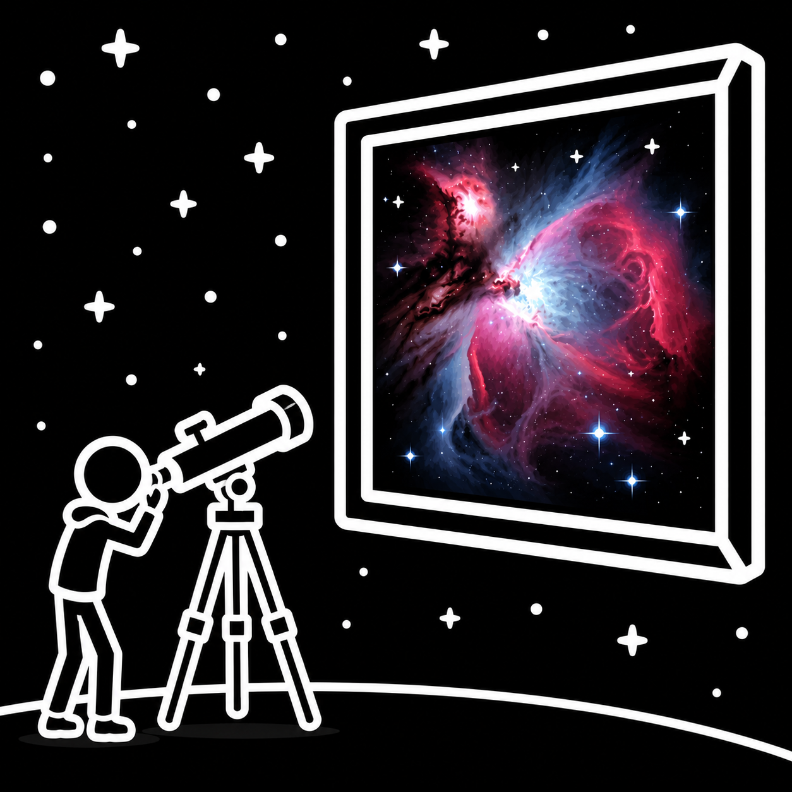

  
  <h1>MyAstroSky</h1>
  
An interactive sky map to overlay and plan your astrophotography

  <a href="#/user/getting-started" class="cta-card">
    📖
    User Guide
    Get started, upload photos, plate solve, plan targets
  </a>
  <a href="#/dev/architecture" class="cta-card">
    ⚙
    Developer Docs
    Architecture, UI guidelines, DSO catalog, CI/CD
  </a>

---

## What is MyAstroSky?

MyAstroSky lets you overlay your astrophotographs onto a live, interactive sky map and plan future imaging sessions from a targets recommender.

  

    <strong>Sky Map</strong>
    Interactive stereographic projection — pan, zoom, overlay photos
  

  

    <strong>Plate Solving</strong>
    Auto-position photos via WCS metadata, ASTAP, solve-field, or astrometry.net
  

  

    <strong>Targets</strong>
    DSO recommendations scored for your gear, location, and date
  

  

    <strong>Gallery</strong>
    Grid view of all uploads — click to jump to the sky map
  

  

    <strong>Search</strong>
    Find any star or deep-sky object by name, Bayer, Flamsteed, or catalog ID
  

  

    <strong>Two themes</strong>
    Modern cold-blue or warm amber — toggle with the button in the sidebar
  

---

## Quick links

| | |
|---|---|
| **New user?** | Start with [Getting Started](user/getting-started.md) |
| **Using the app?** | See [Features Reference](user/user-guide.md) |
| **Plate solver setup** | See [Installing Plate Solvers](user/installing-solvers.md) |
| **Something broken?** | See [Troubleshooting](user/troubleshooting.md) |
| **Contributing?** | Start with [Architecture](dev/architecture.md) |
